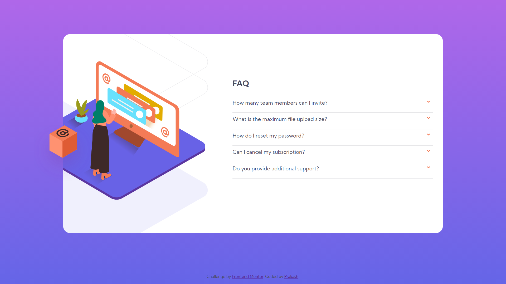

# Frontend Mentor - FAQ accordion card solution

This is a solution to the [FAQ accordion card challenge on Frontend Mentor](https://www.frontendmentor.io/challenges/faq-accordion-card-XlyjD0Oam). Frontend Mentor challenges help you improve your coding skills by building realistic projects. 

## Table of contents

- [Overview](#overview)
  - [The challenge](#the-challenge)
  - [Screenshot](#screenshot)
  - [Links](#links)
- [My process](#my-process)
  - [Built with](#built-with)
  - [What I learned](#what-i-learned)
  - [Continued development](#continued-development)
- [Author](#author)
- [Acknowledgments](#acknowledgments)

**Note: Delete this note and update the table of contents based on what sections you keep.**

## Overview

### The challenge

Users should be able to:

- View the optimal layout for the component depending on their device's screen size.
- See hover states for all interactive elements on the page.
- Hide/Show the answer to a question when the question is clicked.

### Screenshot

### Links

- Solution URL: [https://www.frontendmentor.io/solutions/faq-accordion-page-yCWa3edBM](https://www.frontendmentor.io/solutions/faq-accordion-page-yCWa3edBM)
- Live Site URL: [https://mewebbie.github.io/faq-accordian/](https://mewebbie.github.io/faq-accordian/)

## My process

### Built with

- Semantic HTML5 markup
- CSS3
- Vannila JS + jQuery.js

### What I learned

I always believe that more of learning happens when one tries to implement already learnt techniques. This is the first time I had attempted to design a responsive webpage and I'm quite happy with the way I gathered concepts and techniques to successfully complete this project.

### Continued development

I really look forward to clear my doubts about keyframes and transitions of CSS as they excite me a lot. I would also like to focus on JS libraries that have become very much popular and every web-developer is expected to have a good idea about them.

## Author

- Frontend Mentor - [@mewebbie](https://www.frontendmentor.io/profile/mewebbie)
- Twitter - [@prakashvoiceout](https://www.twitter.com/prakashvoiceout)

## Acknowledgments

Thank you "Frontend Mentor"!
